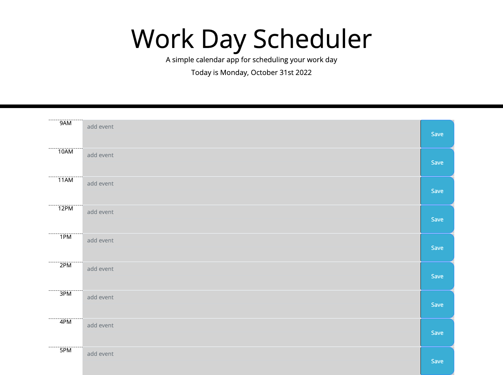

# Work-Day-Scheduler

## Description

The goal was to create a dynamic 9 hour work day scheduler that a user may add their events during the day and it will be saved. Using moment.js and jquery, I was able to make this application. The day at the header of the page updates to the current time. The hour blocks change color depending on if it's the past, present, or future. There is an add event area in each row with it's own save button. 

## Installation

No installation required

## Usage

Please follow this link for the [Work Day Scheduler]
(https://carrieky04.github.io/Work-Day-Scheduler/)

 
    
   

## Credits

I watched these tutorials to further my understanding

(https://youtu.be/n80RRNS1k64)

(https://youtu.be/Thnv77n2e6Q)

## License

MIT License

Copyright (c) [year] [fullname]

Permission is hereby granted, free of charge, to any person obtaining a copy
of this software and associated documentation files (the "Software"), to deal
in the Software without restriction, including without limitation the rights
to use, copy, modify, merge, publish, distribute, sublicense, and/or sell
copies of the Software, and to permit persons to whom the Software is
furnished to do so, subject to the following conditions:

The above copyright notice and this permission notice shall be included in all
copies or substantial portions of the Software.

THE SOFTWARE IS PROVIDED "AS IS", WITHOUT WARRANTY OF ANY KIND, EXPRESS OR
IMPLIED, INCLUDING BUT NOT LIMITED TO THE WARRANTIES OF MERCHANTABILITY,
FITNESS FOR A PARTICULAR PURPOSE AND NONINFRINGEMENT. IN NO EVENT SHALL THE
AUTHORS OR COPYRIGHT HOLDERS BE LIABLE FOR ANY CLAIM, DAMAGES OR OTHER
LIABILITY, WHETHER IN AN ACTION OF CONTRACT, TORT OR OTHERWISE, ARISING FROM,
OUT OF OR IN CONNECTION WITH THE SOFTWARE OR THE USE OR OTHER DEALINGS IN THE
SOFTWARE.

---

